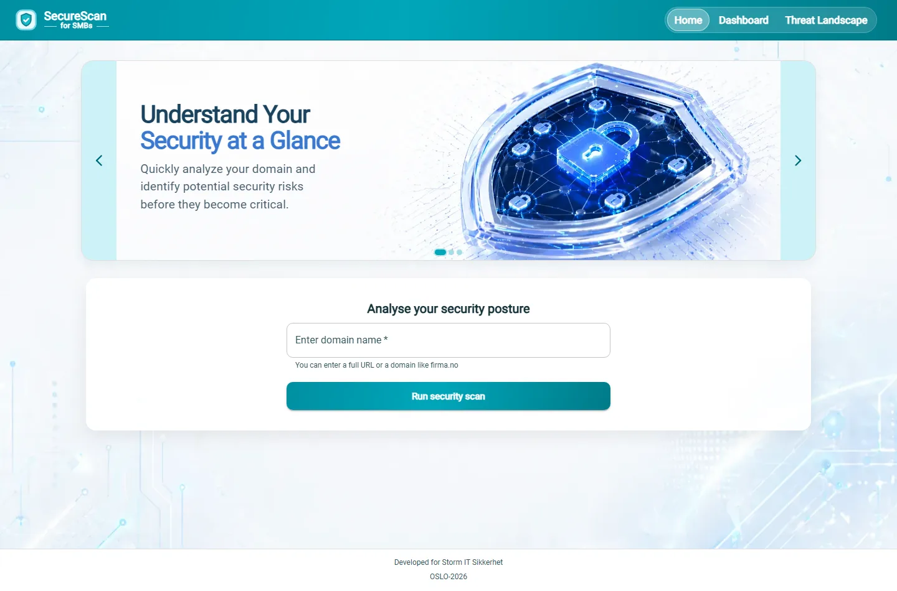
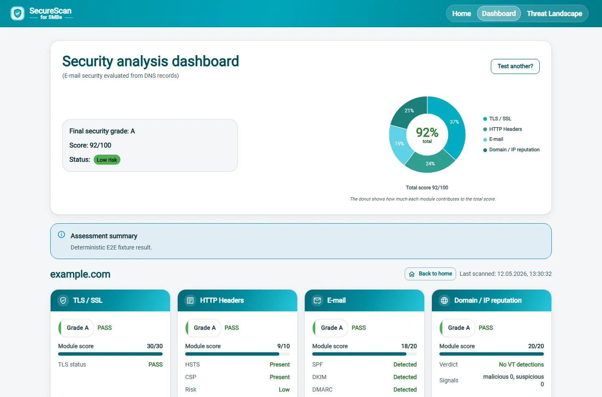

# Security Assessment Platform for SMB Customers

This project is a bachelor project centered on an ASP.NET Core security-assessment API and a React dashboard. It is designed to give small and medium-sized business customers a simple, structured overview of domain security based on several technical checks.

## What the project does

The platform evaluates a target domain and produces a combined assessment score with grades, statuses, module-level scoring, alerts, and supporting detail views in the frontend dashboard.

The current assessment includes:

- SSL/TLS analysis
- HTTP security header analysis
- Email security analysis
- Reputation analysis
- PQC readiness analysis

## Screenshots

Home page and scan entry:



Security dashboard result:



## Main API endpoints

The API exposes dedicated endpoints for each module, one combined assessment endpoint, and one SSL detail endpoint:

- `/api/assessment/check/{domain}`
- `/api/ssl/check/{domain}`
- `/api/ssl/details/{domain}`
- `/api/headers/check/{domain}`
- `/api/email/check/{domain}`
- `/api/reputation/check/{domain}`
- `/api/pqc/check/{domain}`

The API root route also responds at:

- `/`

## Project structure

- `API/Controllers/Api` contains the REST API controllers
- `API/Services` contains the core assessment logic and external service clients
- `API/DTOs` contains request and response models
- `API/DAL` contains data access and repository code
- `Frontend` contains convenience scripts that forward to the dashboard app
- `Frontend/dashboard` contains the React, TypeScript, Vite, and Material UI dashboard
- `Test` contains the reduced test workspace, a manual delivery checklist, and a short summary report

## Running the project

Quick summary:

- Start the API from `API`.
- Run `npm run setup` once in `Frontend`, then start the dashboard with `npm run dev`.
- Running `npm run dev` inside `Frontend` starts the frontend system at `http://localhost:5187/`.
- Run the full automated suite with `npm run test:all` from either the repository root or `Test`.

From the `API` folder:

```powershell
dotnet run --project .\SecurityAssessmentAPI.csproj --launch-profile http
```

Swagger UI:

```text
http://localhost:1072/swagger
```

OpenAPI JSON:

```text
http://localhost:1072/swagger/v1/swagger.json
```

From the `Frontend` folder, install the dashboard dependencies once and then start the dashboard:

```powershell
cd .\Frontend
npm run setup
npm run dev
```

This starts the dashboard dev server on `http://localhost:5187`.

With the API running, the frontend proxies `/api` requests to `http://localhost:1072` in dev. You can override the target with `VITE_DEV_API_PROXY` in `Frontend/dashboard/.env.development`.

If you want to work directly inside the dashboard app instead:

```powershell
cd .\Frontend\dashboard
npm install
npm run dev
```

Run the full automated test suite from the repository root:

```powershell
.\run-tests.ps1
```

Or use the npm shortcut from the repository root:

```powershell
npm run test:all
```

You can also run the same combined suite from the `Test` folder:

```powershell
cd .\Test
npm run test:all
```

The combined suite covers:

- backend unit tests
- backend integration smoke tests
- frontend unit tests
- one Playwright E2E smoke test for the main scan flow

The combined suite does not run manual/report-only files:

- `Test/ManualTests`
- `Test/Reports`

## Notes

- The backend uses an in-memory database configuration in the current app setup.
- The project depends on external services and network-based checks.
- Some modules use third-party APIs and HTTP/DNS lookups.
- Output quality depends on network availability and the quality of upstream data sources.

## Purpose

The goal of the project is to provide a practical API-based security assessment workflow that can be used as a basis for customer-facing evaluation, experimentation, and further development.
